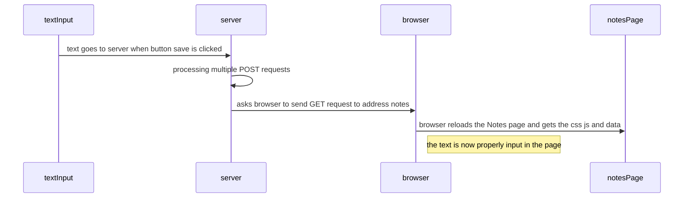

```mermaid
sequenceDiagram
  participant textInput
  participant server
  participant browser
  participant notesPage
  textInput->>server: text goes to server when button save is clicked
  server->>server: processing multiple POST requests
  server->>browser: asks browser to send GET request to address notes
  browser->>notesPage: browser reloads the Notes page and gets the css js and data
  Note right of browser: the text is now properly input in the page
```
