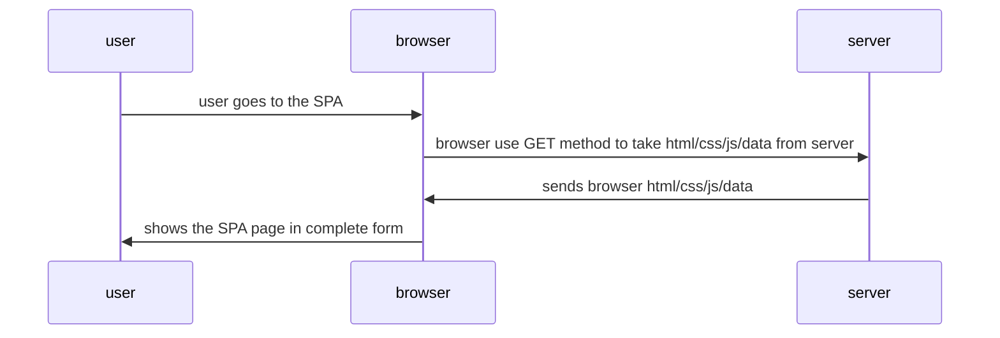

```mermaid
sequenceDiagram
participant user
participant browser
participant server

user->>browser: user goes to the SPA
browser->>server: browser use GET method to take html/css/js/data from server
server->>browser: sends browser html/css/js/data
browser->>user: shows the SPA page in complete form
```
