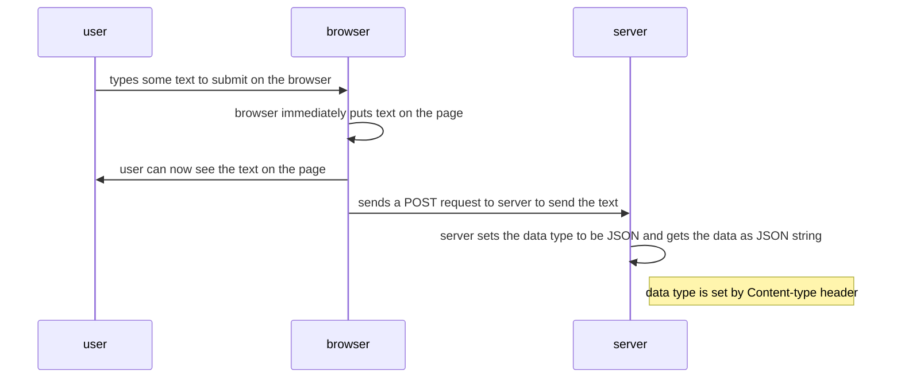

```mermaid
sequenceDiagram
  participant user
  participant browser
  participant server
    user->>browser: types some text to submit on the browser
    browser->>browser: browser immediately puts text on the page
    browser->>user: user can now see the text on the page
    browser->>server: sends a POST request to server to send the text
    server->>server: server sets the data type to be JSON and gets the data as JSON string
    Note right of server: data type is set by Content-type header
```
